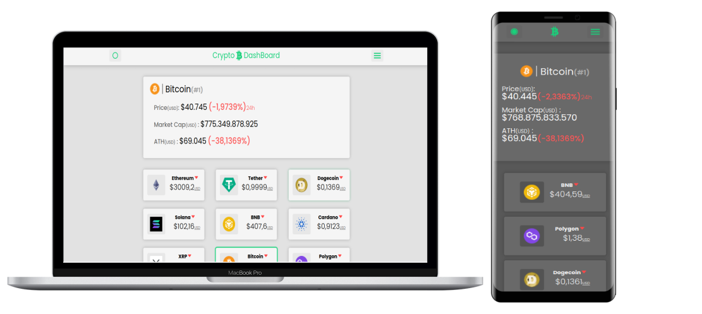

<h1 align="center"> Crypto Dashboard 📈</h1>

<h2 align="center">
<a href="https://crypto-dashboard-nine.vercel.app/">
        
Acessar Demostração🚀

</a>

</h2>

## Descrição 📎

Crypto Dashboard é uma aplicação web para visualização de valor atual, capitalização de mercado, valor máximo e variação de preço de crypto moedas. Para adicionar moedas ao projetos basta realizar uma PR para o arquivo de <a href="./src/data.js">dados</a> adicionado o id do token de acordo com <a href="https://www.coingecko.com/pt">Gecko Coin</a>

## Funcionalidades 🏁

-   Global
    -   [x] Acessar API do Gecko Coin
    -   [x] Deploy público via Vercel
    -   [x] Temas claro e escuro alternável
    -   [ ] Armazenar tema no local Storage

## Ferramentas Utilizadas ⚙️

    
    
    
    

